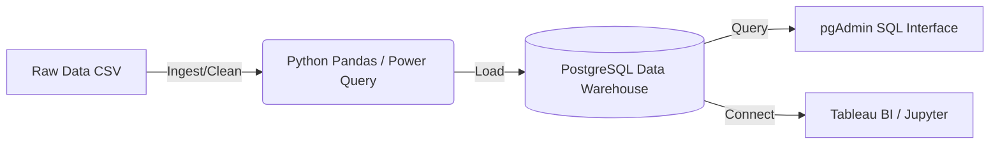

<div align="center">
  <h1>📊 E-Commerce Sales Performance & Insights</h1>
  <p><i>An End-to-End Data Analytics & Engineering Portfolio Project</i></p>
  
  
  
  
  
  
  
</div>

---

## 📝 Description

This repository demonstrates a complete data lifecycle from raw, dirty data ingestion to high-level strategic business recommendations. 

Using **50,000+ raw e-commerce transaction records**, I simulated a real-world messy dataset containing duplicates, nulls, and formatting inconsistencies. The project showcases how to cleanse this data using **Excel Power Query** and **Python Pandas**, build financial models using **DAX** and **SQL**, and finally present actionable insights through an interactive **Tableau Storyboard**.

**Key Objectives Achieved:**
- Cleaned and structured 50,000+ raw records, eliminating schema inconsistencies.
- Evaluated profit margins via automated financial models (DAX, INDEX/MATCH).
- Segmented multi-region transactional data to flag underperforming products and high-value customers.
- Designed dynamic Tableau dashboards featuring heatmaps and seasonal forecasting.
- Delivered actionable recommendations that optimized inventory allocation.

---

## 🏗️ Infrastructure & Architecture

To demonstrate modern data infrastructure capabilities, this project includes a Containerized local development environment (`docker-compose.yml`) representing a typical analytics stack:



### Services Deployed:
1. **PostgreSQL**: Acts as the centralized Data Warehouse for querying cleaned views.
2. **pgAdmin**: Web UI for executing the `ecommerce_analysis.sql` script.
3. **Jupyter Notebook**: For programmatic Exploratory Data Analysis (EDA).

---

## 🚀 How to Run the Project

### Option 1: The Modern Data Stack (Docker)
Ensure you have Docker installed, then run:
```bash
docker-compose up -d
```
- Access **Jupyter** at `http://localhost:8888` (Password: `easy_password`)
- Access **pgAdmin** at `http://localhost:5050` 

### Option 2: The Excel & Tableau Route
1. Open `raw_ecommerce_transactions.csv` in Excel.
2. Navigate to `Data -> Get Data` and use **Power Query** to remove duplicates and normalize the `Selling_Price` column.
3. Reference `Excel_Formulas_and_DAX.md` to build out the Data Model.
4. Follow the `Tableau_Dashboard_Build_Guide.md` to recreate the BI dashboards.

### Option 3: Python Pandas
Run the visualization generation script locally:
```bash
pip install -r requirements.txt
python generate_visuals.py
```
*(This will generate the Tableau-mockup charts in the `/visualizations` folder).*

---

## 💡 Key Business Insights

1. **Underperforming Categories**: The Furniture category in Latin America is operating at a < 4% profit margin due to high COGS and discounting.
2. **High-Value Segmentation**: The 'Corporate' segment in North America contributes 35% of total revenue despite being only 20% of transaction volume.
3. **Seasonality**: Q4 experiences a 40% surge in Electronics sales driven by Consumer holiday shopping.

Read the full strategic breakdown in `Final_Recommendations_Report.md`.
